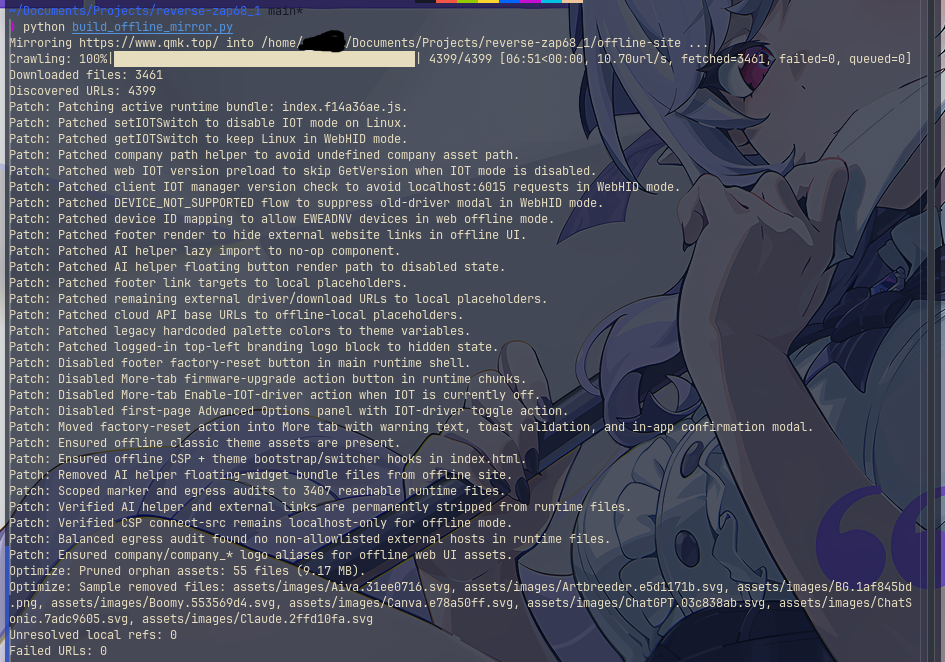

# OpenKeeb

OpenKeeb is an offline Linux-focused rebuild of the `https://www.qmk.top/` web driver. It mirrors the app locally and applies offline hardening to neuter telemetry and tracking egress: cloud API/download endpoints are rewritten to local `/offline-disabled/*` placeholders, AI helper and external-link surfaces are removed, a strict Content Security Policy limits connections to localhost/self, and a runtime offline guard blocks non-local `fetch`, `XMLHttpRequest`, `WebSocket`, `EventSource`, `sendBeacon`, `window.open`, and external link navigation. Build-time enforcement checks fail rebuilds if blocked domains or markers reappear.

## Quick start for new users

Follow these steps in order.

### 1) Install requirements

- `git`
- Python `3.10+`
- A Chromium-based browser with WebHID support (Chrome, Chromium, or Edge)

### 2) Set Linux WebHID permissions (udev) (required)

If your keyboard appears in `lsusb` but not in `Add Device`, add a udev rule first.

Check USB IDs:

```bash
lsusb
```

Create a rule file:

```bash
sudo nano /etc/udev/rules.d/50-openkeeb.rules
```

Add this line and save:

```text
KERNEL=="hidraw*", ATTRS{idVendor}=="3151", ATTRS{idProduct}=="502f", MODE="0666", TAG+="uaccess"
```

If your board uses different IDs, replace `3151` and `502f` with your values from `lsusb`.

Reload rules:

```bash
sudo udevadm control --reload-rules
sudo udevadm trigger
```

Replug the keyboard and fully restart the browser.

### 3) Clone this repository

```bash
git clone https://github.com/syach1/openkeeb.git OpenKeeb
cd OpenKeeb
```

### 4) Build the local offline site

```bash
python build_offline_mirror.py
```

The build will take some time. You will see a progress bar and patch steps in the terminal while it runs.



### 5) Run the local server

```bash
./run_offline.sh
```

Open this URL in your browser:

```text
http://127.0.0.1:4173/
```

### 6) Connect your keyboard

- Click `Add Device` in the web UI.
- Select your keyboard in the browser dialog.
- Grant permission when prompted.

## Daily commands

- Rebuild mirror output: `python build_offline_mirror.py`
- Serve default port: `./run_offline.sh`
- Serve custom port: `./run_offline.sh 8080`
- Keep orphaned files for diagnostics: `python build_offline_mirror.py --no-prune-orphans`
- Disable crawl progress output: `python build_offline_mirror.py --no-progress`


## Troubleshooting

- `offline-site` missing: run `python build_offline_mirror.py` first.
- WebHID still unavailable: verify udev rules and replug the device.
- Ubuntu Snap Chromium may still block `hidraw`: use non-Snap Chrome/Chromium.
- Always use `http://127.0.0.1:<port>/`, not `file://`.
- If behavior looks stale, clear site data for `127.0.0.1:<port>` or use Incognito.

## Project layout

- Source code: `src/offline_mirror/`, `build_offline_mirror.py`, `serve_offline.py`, `scripts/run_offline.sh`
- Generated output: `offline-site/` (recreated by build)
- Optional local diagnostics storage: `archive/raw/`

## License and non-affiliation

- MIT applies to original tooling code and docs in this repository.
- This project is independent and not affiliated with EPOMAKER, Rongyuan, GearHub, or qmk.top.
- `offline-site/` is generated locally; upstream third-party assets remain under their original licenses/terms.
- You are responsible for complying with upstream terms and local laws.

## Additional docs

- Generated-output note for mirror root: `offline-site/README.md`
- Legal/compliance details: `LEGAL.md`
